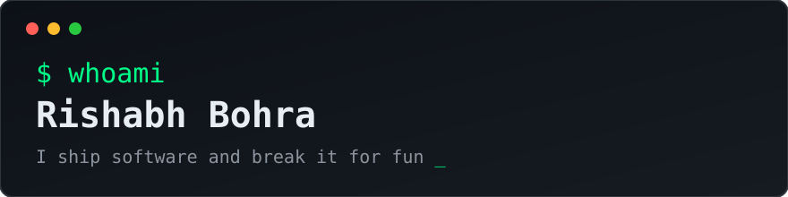

  
  

## What I'm building

**Scoot** - companion app for TVS smart scooters. Live telemetry, trip history, turn-by-turn nav mirrored to the cluster, media and call controls over BLE. Protocol fully reverse-engineered from the official app and JRC docs. Shipped to real users, audited every release.
[repo](https://github.com/sudo-Mystic/Scoot)

**detroit-jev** - an engine that plays Detroit: Become Human start to finish, with an AI making all 226 story decisions live through a real game backend.
[repo](https://github.com/sudo-Mystic/detroit-jev)

**Android security research** - static and dynamic teardown of popular Indian consumer apps. Real findings, disclosed through proper channels. Assume breach, verify everything.

## Elsewhere

- Baja SAE collegiate racing, Team GSRacers. I like things with engines.
- ESP8266 and Arduino builds: Kodi remotes, weather stations, miners. If it has a chip, I've probably flashed it.

## Arsenal

---

<i>"If it runs code, it can be understood. If it can be understood, it can be improved. Or broken."</i>

